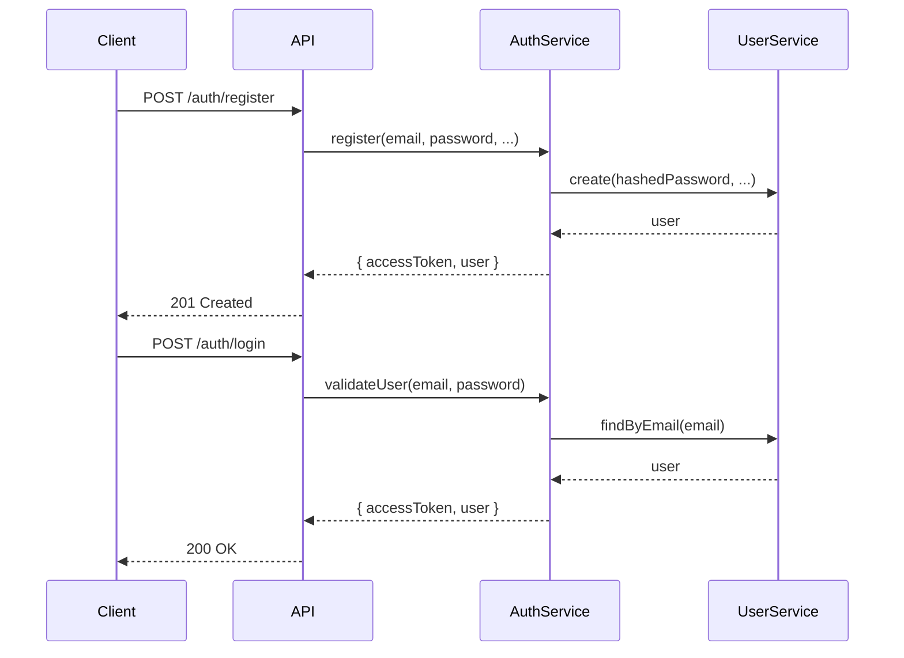
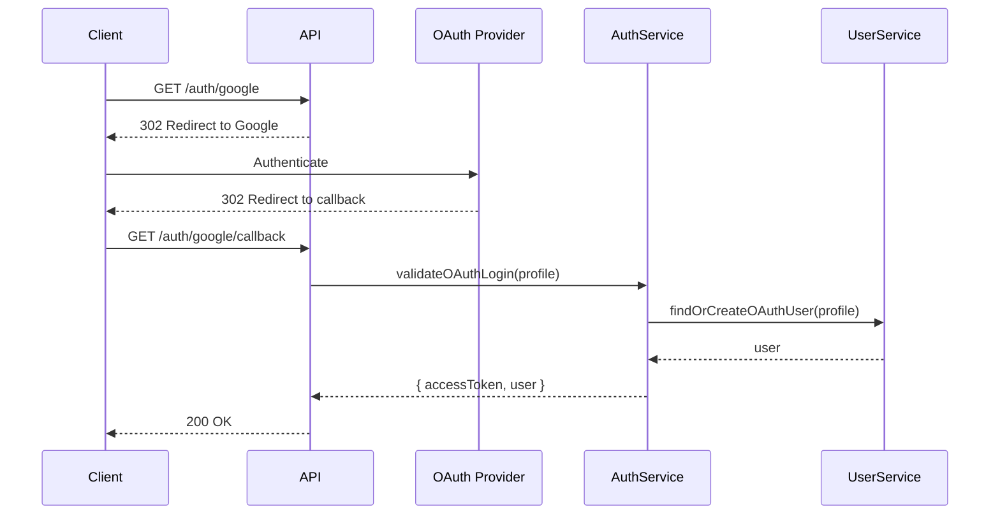

# 🔐 NestJS Auth with RBAC Starter Kit

A **production-ready** NestJS authentication starter kit featuring JWT-based stateless authentication, Role-Based Access Control (RBAC), and support for local (email/password) and OAuth 2.0 providers (Google, Facebook, GitHub).

## ✨ Features

- ✅ **JWT Authentication** - Stateless token-based authentication
- ✅ **Role-Based Access Control (RBAC)** - Declarative permission system (`@Roles()`)
- ✅ **Local Authentication** - Email and password with secure bcrypt hashing
- ✅ **OAuth 2.0 SSO** - Google, Facebook, and GitHub integration
- ✅ **Modular Architecture** - Clean separation of concerns, easy to extend
- ✅ **TypeScript** - Full type safety
- ✅ **Swagger Documentation** - Auto-generated API docs
- ✅ **Production Ready** - Security best practices built-in

## 📋 Table of Contents

- [Installation](#installation)
- [Environment Configuration](#environment-configuration)
- [Authentication Flows](#authentication-flows)
- [API Endpoints](#api-endpoints)
- [Architecture](#architecture)
- [Adding New OAuth Providers](#adding-new-oauth-providers)
- [Production Deployment](#production-deployment)

## 🚀 Installation

```bash
# Install dependencies
npm install

# Copy environment template
cp .env.example .env

# Configure your environment variables (see below)
# Edit .env with your actual credentials

# Start development server
npm run start:dev
```

The application will start on `http://localhost:3000`

Access Swagger documentation at `http://localhost:3000/docs`

## ⚙️ Environment Configuration

Create a `.env` file in the root directory with the following variables:

```env
# Application
PORT=3000
NODE_ENV=development

# JWT Configuration
JWT_SECRET=your-super-secret-jwt-key-change-this-in-production
JWT_EXPIRES_IN=1h

# Google OAuth (Optional - only if using Google login)
GOOGLE_CLIENT_ID=your-google-client-id
GOOGLE_CLIENT_SECRET=your-google-client-secret
GOOGLE_CALLBACK_URL=http://localhost:3000/auth/google/callback

# Facebook OAuth (Optional - only if using Facebook login)
FACEBOOK_CLIENT_ID=your-facebook-app-id
FACEBOOK_CLIENT_SECRET=your-facebook-app-secret
FACEBOOK_CALLBACK_URL=http://localhost:3000/auth/facebook/callback

# GitHub OAuth (Optional - only if using GitHub login)
GITHUB_CLIENT_ID=your-github-client-id
GITHUB_CLIENT_SECRET=your-github-client-secret
GITHUB_CALLBACK_URL=http://localhost:3000/auth/github/callback
```

### Setting up OAuth Providers

#### Google OAuth

1. Go to [Google Cloud Console](https://console.cloud.google.com/)
2. Create a new project or select existing
3. Enable Google+ API
4. Create OAuth 2.0 credentials
5. Add authorized redirect URI: `http://localhost:3000/auth/google/callback`
6. Copy Client ID and Client Secret to `.env`

#### Facebook OAuth

1. Go to [Facebook Developers](https://developers.facebook.com/)
2. Create a new app
3. Add Facebook Login product
4. Add redirect URI: `http://localhost:3000/auth/facebook/callback`
5. Copy App ID and App Secret to `.env`

#### GitHub OAuth

1. Go to [GitHub Developer Settings](https://github.com/settings/developers)
2. Create a new OAuth App
3. Set callback URL: `http://localhost:3000/auth/github/callback`
4. Copy Client ID and Client Secret to `.env`

## 🔄 Authentication Flows

### Local Authentication (Email/Password)



### OAuth Authentication



## 🛡️ Role-Based Access Control (RBAC)

This starter kit includes a robust RBAC system designed for scalability and ease of use.

### 1. Define Roles

Roles are defined in `src/rbac/role.enum.ts`:

```typescript
export enum Role {
  SUPER_ADMIN = 'SUPER_ADMIN',
  ADMIN = 'ADMIN',
  USER = 'USER',
}
```

### 2. Protect Routes

Use the `@Roles()` decorator to protect your endpoints.

```typescript
@Get('admin')
@Roles(Role.ADMIN) // Only ADMIN can access
getAdminData() {
  return 'Admin Data';
}

@Get('flexible')
@Roles(Role.ADMIN, Role.USER) // ADMIN or USER can access
getFlexibleData() {
  return 'Flexible Data';
}
```

### 3. How it Works

1.  **Login**: When a user logs in, their roles are embedded into the `accessToken` payload.
2.  **Request**: Client sends the `accessToken` in the `Authorization` header.
3.  **Guard**: The route is protected by `JwtAuthGuard` (validates token) and `RolesGuard` (validates roles). `RolesGuard` checks if the user has the required roles.
4.  **Result**:
    - If authorized: Request proceeds.
    - If unauthorized: Returns `403 Forbidden`.

## 📡 API Endpoints

### Authentication

#### Register

```http
POST /auth/register
Content-Type: application/json

{
  "email": "user@example.com",
  "password": "SecurePass123!",
  "firstName": "John",
  "lastName": "Doe",
  "roles": ["USER"]
}
```

**Response:**

```json
{
  "accessToken": "eyJhbGciOiJIUzI1NiIsInR5cCI6IkpXVCJ9...",
  "user": {
    "id": "uuid",
    "email": "user@example.com",
    "firstName": "John",
    "lastName": "Doe",
    "createdAt": "2024-01-05T10:00:00.000Z",
    "roles": ["USER"]
  }
}
```

#### Login

```http
POST /auth/login
Content-Type: application/json

{
  "email": "user@example.com",
  "password": "SecurePass123!"
}
```

**Response:** Same as register

#### Get Current User

```http
GET /auth/me
Authorization: Bearer <access_token>
```

**Response:**

```json
{
  "id": "uuid",
  "email": "user@example.com",
  "firstName": "John",
  "lastName": "Doe",
  "createdAt": "2024-01-05T10:00:00.000Z",
  "roles": ["USER"]
}
```

### OAuth Endpoints

#### Google OAuth

```http
GET /auth/google              # Initiates Google OAuth flow
GET /auth/google/callback     # Google callback (handled automatically)
```

#### Facebook OAuth

```http
GET /auth/facebook            # Initiates Facebook OAuth flow
GET /auth/facebook/callback   # Facebook callback (handled automatically)
```

#### GitHub OAuth

```http
GET /auth/github              # Initiates GitHub OAuth flow
GET /auth/github/callback     # GitHub callback (handled automatically)
```

All OAuth callbacks return the same response format as login/register.

### RBAC Testing (`/rbac-test`)

Use these endpoints to verify role permissions.

```http
GET /rbac-test/public           # Accessible by anyone with a token
GET /rbac-test/user             # Requires USER role
GET /rbac-test/admin            # Requires ADMIN role
GET /rbac-test/super-admin      # Requires SUPER_ADMIN role
GET /rbac-test/admin-or-user    # Requires ADMIN or USER role
```

## 🏗 Architecture

### Project Structure

```
src/
├── auth/
│   ├── dto/                    # Data Transfer Objects
│   │   ├── register.dto.ts
│   │   ├── login.dto.ts
│   │   └── auth-response.dto.ts
│   ├── guards/                 # Authentication Guards
│   │   ├── local-auth.guard.ts
│   │   ├── jwt-auth.guard.ts
│   │   ├── google-auth.guard.ts
│   │   ├── facebook-auth.guard.ts
│   │   └── github-auth.guard.ts
│   ├── interfaces/             # TypeScript Interfaces
│   │   ├── jwt-payload.interface.ts
│   │   └── oauth-profile.interface.ts
│   ├── strategies/             # Passport Strategies
│   │   ├── local.strategy.ts
│   │   ├── jwt.strategy.ts
│   │   ├── google.strategy.ts
│   │   ├── facebook.strategy.ts
│   │   └── github.strategy.ts
│   ├── auth.controller.ts      # Authentication endpoints
│   ├── auth.service.ts         # Core auth logic
│   └── auth.module.ts          # Auth module configuration
├── rbac/
│   ├── role.enum.ts            # Role definitions
│   ├── roles.decorator.ts      # Custom decorator
│   ├── roles.guard.ts          # Role verification guard
│   ├── rbac.interceptor.ts     # Unified error handling
│   ├── rbac-test.controller.ts # Test controller
│   └── rbac.module.ts          # RBAC module
├── user/
│   ├── interfaces/
│   │   └── user.interface.ts
│   ├── user.service.ts         # User management (in-memory)
│   └── user.module.ts
├── common/
│   └── utils/
│       └── hash.util.ts        # Password hashing utilities
├── app.module.ts
└── main.ts
```

### Key Design Decisions

#### 1. **Strategy Pattern**

Each authentication method (Local, JWT, OAuth providers) is implemented as a separate Passport strategy. This makes the system:

- Easy to understand
- Easy to extend
- Easy to test
- Easy to maintain

#### 2. **Database Abstraction**

The `UserService` uses an in-memory store by default. In production, replace this with your database solution:

```typescript
// Example with TypeORM
@Injectable()
export class UserService {
  constructor(
    @InjectRepository(User)
    private userRepository: Repository<User>,
  ) {}

  async create(userData: Partial<User>): Promise<User> {
    const user = this.userRepository.create(userData);
    return this.userRepository.save(user);
  }

  async findByEmail(email: string): Promise<User | null> {
    return this.userRepository.findOne({ where: { email } });
  }
  // ... other methods
}
```

> **Note**: Ensure your `User` entity includes a `roles` column (array of strings or relation) to persist RBAC roles.

#### 3. **OAuth Profile Normalization**

All OAuth providers return different profile structures. We normalize them to a consistent `OAuthProfile` interface:

```typescript
interface OAuthProfile {
  provider: string;
  providerId: string;
  email: string;
  firstName: string;
  lastName: string;
}
```

This allows the `AuthService` to handle all OAuth providers identically.

#### 4. **Security Best Practices**

- ✅ Passwords hashed with bcrypt (10 salt rounds)
- ✅ JWT tokens contain minimal data (only user ID and email)
- ✅ OAuth provider tokens never exposed to clients
- ✅ JWT expiration configured
- ✅ Input validation on all endpoints
- ✅ CORS enabled for frontend integration

#### 5. **Role-Based Access Control (RBAC)**

- **Declarative**: Permissions are defined using decorators (`@Roles`) directly on controllers/handlers.
- **Guard-Based**: The `RolesGuard` enforces permissions. It must be used after `JwtAuthGuard` (e.g., `@UseGuards(JwtAuthGuard, RolesGuard)`).
- **Efficient**: User roles are embedded in the JWT, avoiding database lookups on every protected request.

## 🔧 Adding New OAuth Providers

To add a new OAuth provider (e.g., Twitter, LinkedIn):

### 1. Install the Passport strategy

```bash
npm install passport-twitter @types/passport-twitter
```

### 2. Create the strategy

```typescript
// src/auth/strategies/twitter.strategy.ts
import { Injectable } from '@nestjs/common';
import { PassportStrategy } from '@nestjs/passport';
import { Strategy } from 'passport-twitter';
import { ConfigService } from '@nestjs/config';
import { OAuthProfile } from '../interfaces/oauth-profile.interface';

@Injectable()
export class TwitterStrategy extends PassportStrategy(Strategy, 'twitter') {
  constructor(private readonly configService: ConfigService) {
    super({
      consumerKey: configService.get<string>('TWITTER_CONSUMER_KEY'),
      consumerSecret: configService.get<string>('TWITTER_CONSUMER_SECRET'),
      callbackURL: configService.get<string>('TWITTER_CALLBACK_URL'),
      includeEmail: true,
    });
  }

  async validate(
    token: string,
    tokenSecret: string,
    profile: any,
    done: (error: any, user?: any) => void,
  ): Promise<void> {
    // Normalize to OAuthProfile format
    const oauthProfile: OAuthProfile = {
      provider: 'twitter',
      providerId: profile.id,
      email: profile.emails[0].value,
      firstName: profile.displayName.split(' ')[0],
      lastName: profile.displayName.split(' ').slice(1).join(' '),
    };

    done(null, oauthProfile);
  }
}
```

### 3. Create the guard

```typescript
// src/auth/guards/twitter-auth.guard.ts
import { Injectable } from '@nestjs/common';
import { AuthGuard } from '@nestjs/passport';

@Injectable()
export class TwitterAuthGuard extends AuthGuard('twitter') {}
```

### 4. Add endpoints to controller

```typescript
// src/auth/auth.controller.ts
@Get('twitter')
@UseGuards(TwitterAuthGuard)
async twitterAuth(): Promise<void> {}

@Get('twitter/callback')
@UseGuards(TwitterAuthGuard)
async twitterAuthCallback(@Request() req): Promise<AuthResponseDto> {
  const profile: OAuthProfile = req.user;
  const user = await this.authService.validateOAuthLogin(profile);
  return this.authService.login(user);
}
```

### 5. Register in AuthModule

```typescript
// src/auth/auth.module.ts
providers: [
  // ... existing providers
  TwitterStrategy,
],
```

### 6. Add environment variables

```env
TWITTER_CONSUMER_KEY=your-twitter-consumer-key
TWITTER_CONSUMER_SECRET=your-twitter-consumer-secret
TWITTER_CALLBACK_URL=http://localhost:3000/auth/twitter/callback
```

That's it! The new provider follows the same pattern as existing ones.

## 🚀 Production Deployment

### Environment Variables

**CRITICAL:** Never use default values in production!

```env
# Generate a strong secret (example using Node.js)
# node -e "console.log(require('crypto').randomBytes(32).toString('hex'))"
JWT_SECRET=<your-generated-secret>
JWT_EXPIRES_IN=1h

# Update callback URLs to your production domain
GOOGLE_CALLBACK_URL=https://yourdomain.com/auth/google/callback
FACEBOOK_CALLBACK_URL=https://yourdomain.com/auth/facebook/callback
GITHUB_CALLBACK_URL=https://yourdomain.com/auth/github/callback
```

### Database Integration

Replace the in-memory `UserService` with your database solution:

1. Install your ORM (TypeORM, Prisma, Mongoose)
2. Create User entity/model
3. Update `UserService` methods to use database queries
4. The rest of the auth system remains unchanged!

### Security Checklist

- [ ] Strong JWT secret (minimum 32 characters)
- [ ] Appropriate JWT expiration time
- [ ] HTTPS enabled
- [ ] CORS configured for your frontend domain
- [ ] Rate limiting implemented
- [ ] Helmet.js for security headers
- [ ] Environment variables secured
- [ ] OAuth callback URLs updated for production
- [ ] Database connection secured
- [ ] Logging and monitoring enabled

### Recommended Enhancements

This starter kit provides a solid foundation. Consider adding:

- **Refresh Tokens** - Long-lived tokens for better UX
- **Email Verification** - Verify user emails on registration
- **Password Reset** - Forgot password flow
- **Multi-Factor Authentication (MFA)** - Enhanced security
- **Account Linking** - Link multiple OAuth providers to one account
- **Rate Limiting** - Prevent brute force attacks
- **Audit Logging** - Track authentication events

## 📚 Additional Resources

- [NestJS Documentation](https://docs.nestjs.com)
- [Passport.js Documentation](http://www.passportjs.org/)
- [JWT Best Practices](https://tools.ietf.org/html/rfc8725)

## 📝 License

This starter kit is provided as-is for use in your projects.

---

**Built with ❤️ for real-world applications**
